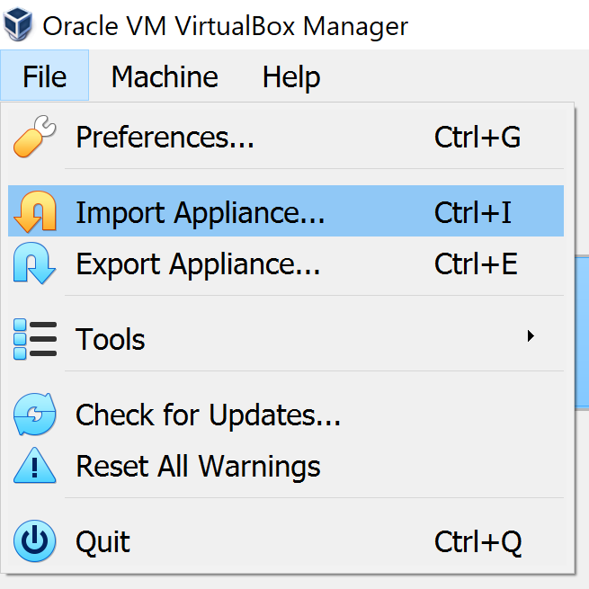
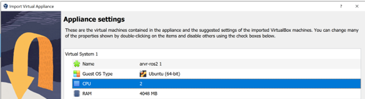
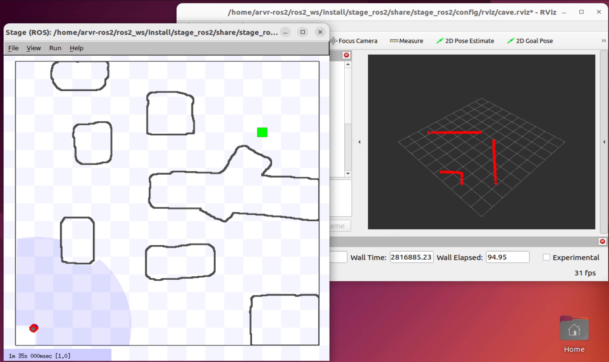

# Wander - Mobile Robotics Labs

## Purpose
The goal of this lab is:
- To get you started writing software that controls a (simulated) robot using ROS.  
- To create your own control strategy for a mobile robot.  
- To test your code in a simulator and on a real robot.  

## Preliminaries
Before you start this lab, you should know the concepts in [ROS tutorials](https://docs.ros.org/en/humble/Tutorials.html).

### ROS-VM Setup Instructions
1. **Download VirtualBox and ROS2 Ubuntu image**  
    - Download and install Oracle VirtualBox from [VirtualBox Downloads](https://www.virtualbox.org/wiki/Downloads).
    - Obtain the `.ova` image file from [this Google Drive link](https://drive.google.com/uc?export=download&id=1VI4HPSwS0SAeqr2DJljcJwEwZ6_M3Szi).

2. **Import the Virtual Machine**  
    - Open VirtualBox.  
    - Go to `File` > `Import Appliance`.  
    

    - Select the `.ova` file you downloaded.
    - Configure the appliance settings:  
        - Set **2 CPUs** (if your system supports it).  
        - Allocate at least **4096MB RAM** (default 2048MB may work, but ROS2 nodes might lag or crash).  
      
    - Click 'Finish' to complete the import process.  
    - Once the appliance is imported, click 'Start' to launch the VM.

3. **Login to the Virtual Machine**  
    - **Username:** `arvr-ros2`  
    - **Password:** `arvr`  

4. **Verify the Ubuntu System**  
    - Open a terminal in the VM.  
    - Run the following commands to check the system setup:  
        ```bash
        # Check Ubuntu version
        lsb_release -a

        # Source ROS2 environment
        source /opt/ros/humble/setup.bash

        # Verify ROS2 installation
        which ros2

        # Verify the teleop-twist-keyboard package is installed
        ros2 pkg list | grep teleop_twist_keyboard
        ```
    - If the `teleop-twist-keyboard` package is not installed, install it using:  
        ```bash
        sudo apt update
        sudo apt install ros-humble-teleop-twist-keyboard
        ```

## TODO

### Starting the Simulator and Teleoperation
1. **Setup the Environment**  
    - Ensure the ROS2 environment is sourced:  
        ```bash
        source /opt/ros/humble/setup.bash
        ```

2. **Launch the Stage Simulator**  
    - Navigate to the workspace and start the simulation:  
        ```bash
        cd ~/ros2_ws
        source install/setup.bash
        ros2 launch stage_ros2 demo.launch.py world:=cave
        ```
        - This will open the simulation and an RViz window for visualizing topics.  
        


3. **Control the Robot**  
    - In a new terminal, open the teleop keyboard to control the robot:  
        ```bash
        source /opt/ros/humble/setup.bash
        ros2 run teleop_twist_keyboard teleop_twist_keyboard
        ```

4. **Monitor Topics**  
    - Use the following command to list active topics:  
        ```bash
        ros2 topic list
        ```

#### Additional Resources
- For more details on the Stage simulator, refer to the [Stage ROS2 GitHub repository](https://github.com/tuw-robotics/stage_ros2).
- If you need to install the packages in a new workspace, follow the [installation guide](https://github.com/tuw-robotics/stage_ros2/blob/humble/res/install.md).

### Creating a New Package for Your Own Teleop

1. **Create a New ROS2 Package**  
    - Navigate to your ROS2 workspace's `src` directory:  
      ```bash
      cd ~/ros2_ws/src
      ```
    - Create a new package named `wander` with the required dependencies (`rclpy`, `geometry_msgs`, and `sensor_msgs`):  
      ```bash
      ros2 pkg create --build-type ament_python wander --dependencies rclpy geometry_msgs sensor_msgs
      ```
    - Ensure the package is in your ROS2 workspace by building the workspace:  
      ```bash
      cd ~/ros2_ws
      colcon build --packages-select wander
      source install/setup.bash
      ```

2. **Write a Node to Drive the Robot Forward**  
    - Create a new Python file (e.g., `forward_move.py`) in the `wander/wander` directory. Here's an example to get you started:
    ```python
    import rclpy
    from rclpy.node import Node
    from geometry_msgs.msg import Twist

    class ForwardNode(Node):
        def __init__(self):
            super().__init__('forward_node')
            # Create a publisher for the 'cmd_vel' topic
            self.publisher_ = self.create_publisher(Twist, 'cmd_vel', 10)
            # Create a timer to call the publish_velocity method periodically
            self.timer = self.create_timer(0.1, self.publish_velocity)

        def publish_velocity(self):
            # Create a Twist message
            msg = Twist()
            # Set linear velocity (forward movement)
            msg.linear.x = 0.0
            msg.linear.y = 0.0
            msg.linear.z = 0.0
            # Set angular velocity (no rotation)
            msg.angular.x = 0.0
            msg.angular.y = 0.0
            msg.angular.z = 0.0
            # Publish the message
            self.publisher_.publish(msg)

    def main(args=None):
        rclpy.init(args=args)
        node = ForwardNode()
        rclpy.spin(node)
        node.destroy_node()
        rclpy.shutdown()

    if __name__ == '__main__':
        main()
    ```

    - Update the `setup.py` file to include your node:
      ```python
      entry_points={
          'console_scripts': [
              'forward_move = wander.forward_move:main',
          ],
      },
      ```
    - Build the package:
      ```bash
      cd ~/ros2_ws
      colcon build --packages-select wander
      source install/setup.bash
      ```
    > **Note:** To avoid Python interpreter errors, configure your text editor to use spaces instead of tabs. For example, if you are using `nano`, run the following command to edit its configuration:
    > ```bash
    > sudo nano /etc/nanorc
    > ```
    > Add these lines to the file:
    > ```
    > set tabsize 4
    > set tabstospaces
    > ```

3. **Run Your Node**  
    - Stop the `teleop_twist_keyboard` node if it's running.  
    - Launch your node:
      ```bash
      ros2 run wander forward_move
      ```

### Adding Reactive Behavior to Your Node

1. **Inspect Available Topics**  
    - Use the following command to list active topics:  
      ```bash
      ros2 topic list
      ```
    - Identify the topic publishing laser scan data (e.g., `/base_scan`) and the odometry topic (e.g., `/odom`).

2. **Modify Your Node to React to Obstacles**  
    - Update your node to subscribe to the laser scan topic and stop the robot when an obstacle is within 50 cm. Here's an example:
      ```python
      import rclpy
      from rclpy.node import Node
      from geometry_msgs.msg import Twist
      from sensor_msgs.msg import LaserScan

      class AvoidNode(Node):
          def __init__(self):
              super().__init__('avoid_node')
              self.publisher_ = self.create_publisher(Twist, 'cmd_vel', 10)
              self.subscription = self.create_subscription(LaserScan, 'base_scan', self.scan_callback, 10)

          def scan_callback(self, msg):
              # TODO process the Laser scan msg
              # The 'ranges' array contains distance measurements to obstacles
              # Each index corresponds to a specific angle of the laser scan
              # Example: msg.ranges[0] is the distance at the minimum angle
              #          msg.ranges[len(msg.ranges)//2] is the distance straight ahead
              #          msg.ranges[-1] is the distance at the maximum angle
              
              # TODO create cmd_vel logic
              cmd_vel_msg = Twist()
              self.publisher_.publish(cmd_vel_msg)

      def main(args=None):
          rclpy.init(args=args)
          node = AvoidNode()
          rclpy.spin(node)
          node.destroy_node()
          rclpy.shutdown()

      if __name__ == '__main__':
          main()
      ```
    - Update the `setup.py` file to include this new node.

    - Ensure that the `package.xml` file for your `wander` package includes the necessary dependencies. Add the following lines inside the `<dependencies>` section:
        ```xml
        <depend>rclpy</depend>
        <depend>geometry_msgs</depend>
        <depend>sensor_msgs</depend>

    - The `LaserScan` message contains the following key fields:
        - `ranges`: An array of distance measurements to obstacles. Each index corresponds to a specific angle of the laser scan.
        - ... [LaserScan message documentation](https://docs.ros.org/en/api/sensor_msgs/html/msg/LaserScan.html).

### Hints
- Use `ros2 topic echo <topic_name>` to inspect topic data.
- Ensure your package dependencies are minimal and accurate in `package.xml`.
- Use a rate limiter (e.g., 10 Hz) to avoid flooding the communication channels.
- Interpret "50 cm from an obstacle" sensibly based on your robot's configuration.
- For Python nodes, ensure the script is executable (`chmod +x <script_name>.py`).


Want to test on a real robot? [Here are some useful hints!](https://www.google.com/url?q=https%3A%2F%2Fgithub.com%2Fmolnarszilard%2Fwander_lab&sa=D&sntz=1&usg=AOvVaw2e6KSOytPbP2wSDsb8VOUJ).
